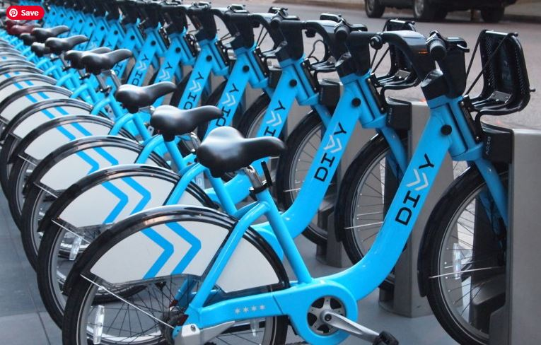

# CyclisticBikeRentalProject
Portfolio project in R

Cyclistic is a bike-share company based in Chicago that in 2016, launched a successful bike-sharing program. Since then, the program has expanded significantly to a fleet of 5,824 bicycles and a network of 692 geotracked stations sprawled across the city. Bikes can be conveniently rented from one station and return to any other station within the network.

Cyclistic's marketing strategy so far focused on building general awareness and appealing to broad consumer segments. One of such strategies is to offer flexibile pricing plans like single-ride passes, full-day passes, and annual memberships.\
**Casual members** 
Customers who purchased single rides or full-day passes are referred to as casual members\
**Cyclistic members** 
Customers who purchased annual memberships

The company's marketing director believes that the company’s future success depends on maximizing the number of annual memberships

The data analyst team is tasked to understand how casual rides and annual members use Cyclist differently. 
Using these insights to then design a new marketing strategy to convert casual rides into annual members
