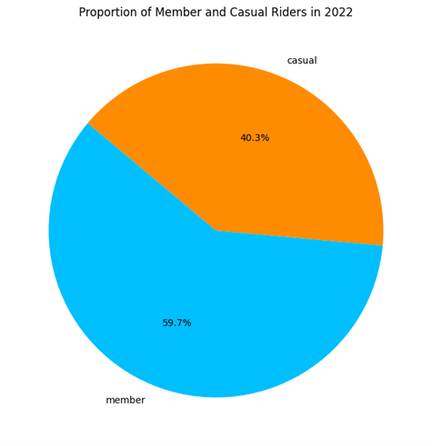
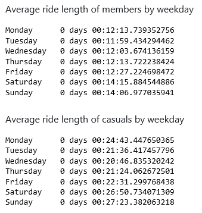
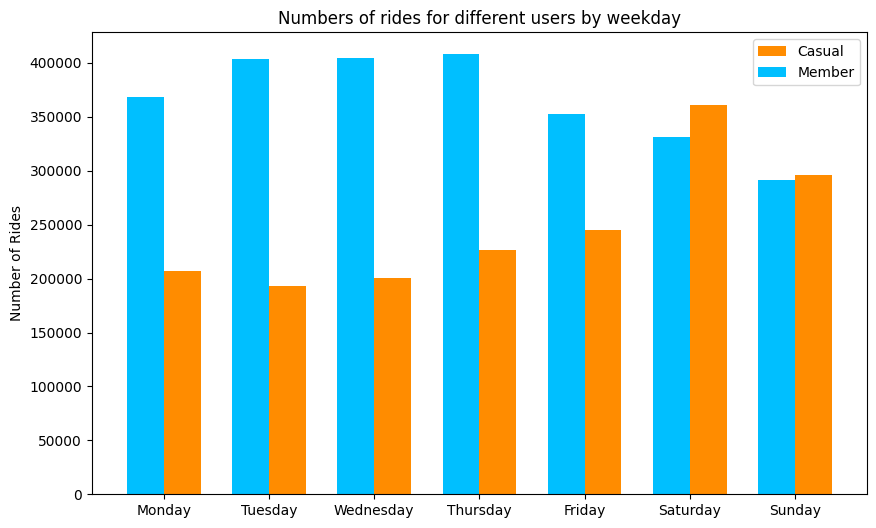

# Cyclistic Case Study
Google Data Analyst capstone project
Refer to jupyter notebook for details on data cleaning and visualizations

## The Business
Cyclistic, a Chicago-based bike-share company, launched a successful program in 2016. Since then, the program expended its fleet of 5,824 bikes and 692 geotracked stations across the city, allowing flexible rental and return options. 
Cyclistic's marketing strategy had focused on broad consumer awareness and offers flexible pricing plans, including single-ride passes, full-day passes, and annual memberships.

## The Task
The company's marketing director believes that the company's future success depends on maximizing the number of annual memberships. 
The data analyst team is tasked to understand how casual rides and annual members use Cyclist differently. Using these insights to then design a new marketing strategy to convert casual rides into annual members

## Analyze
 
**Overall make up of the rides for year 2022** 
Cyclistic members recorded 2,560,294 rides, while casual riders took 1,730,253 trips    
 
**Types of bikes used** 
Members have a higher preference for classic bikes over electric bikes   
 
**Average ride length of casual and members** 
Casuals use the bike longer than members on average 
Members use the bike quite consistently on average 12 mins on the weekdays and 14 mins on the weekends 
Casuals use the bike slightly longer on weekends on average 26 mins   
 
**Total number of ride count over months** 
The total number of rides from both casual and members are higher from May to September. 
Warmer weather and heightened tourism from June to September likely boost casual bike usage, contrasting with the colder Oct to March period. 
Casual rider numbers are more affected by weather changes than member riders   
 
**Number of trips by Days of week** 
Members ride more during the week, likely commuting to work, while casual riders ride more on weekends, probably for sightseeing.   
## Insights
### **Observations:**  
*    Members and casual riders have different usage patterns
*    Members account for most rides
*    Members make consistent short rides throughout the week, likely commuting to work
*    On weekends, member rides increase slightly in number and length but remain shorter than casual users' rides
*    Rides increase during warmer months from May to September
*    There is a preference for classic bikes over electric bikes
### **Recommendations:**
*    Focus on acquiring new customers for memberships rather than converting casual riders
*    Offer limited-time discounts for annual sign-ups from May to September
*    Offer discounted rates during morning and evening commutes to entice sign-ups
*    Maintain and support the existing membership base by introducing loyalty program where points can be redeemed for free ride minutes
*    Offer discounts on pre-paid cheaper ride credits and significant discounts for multi-year memberships
*    Proximity of bike stations to starting points and destinations influences membership signups.
*    Advertise around train and bus stops near bike stations to raise awareness
*    Implement referral codes providing discounts to both referrers and new members
